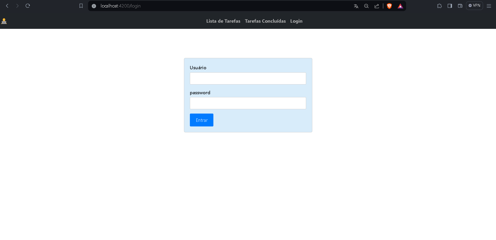
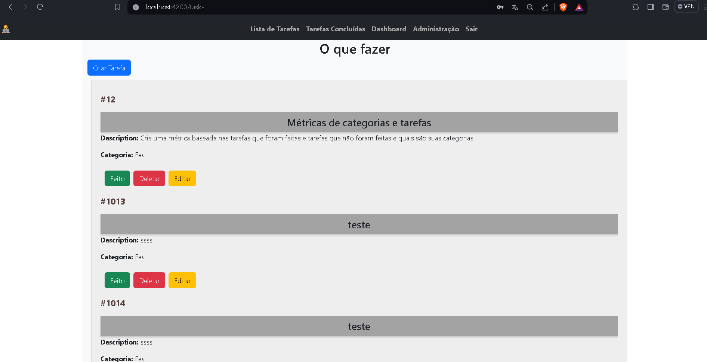
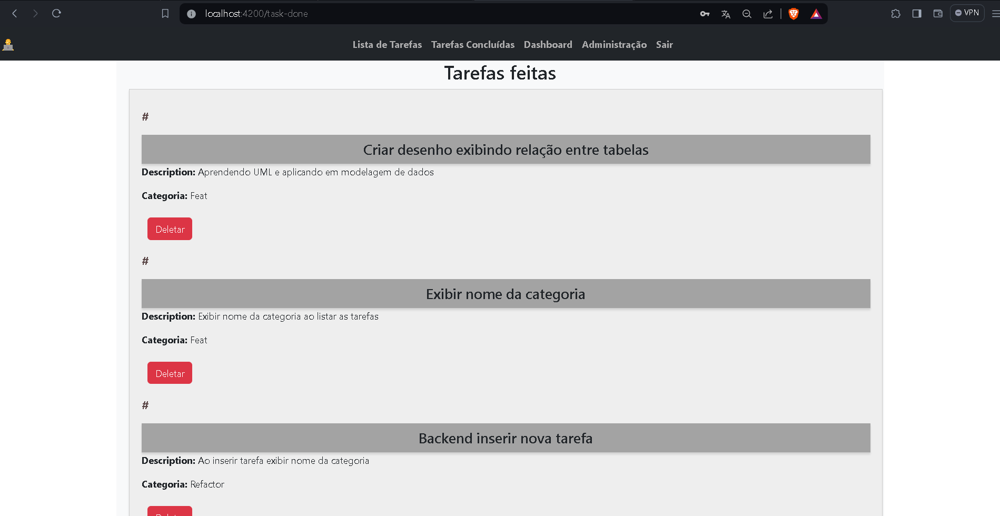
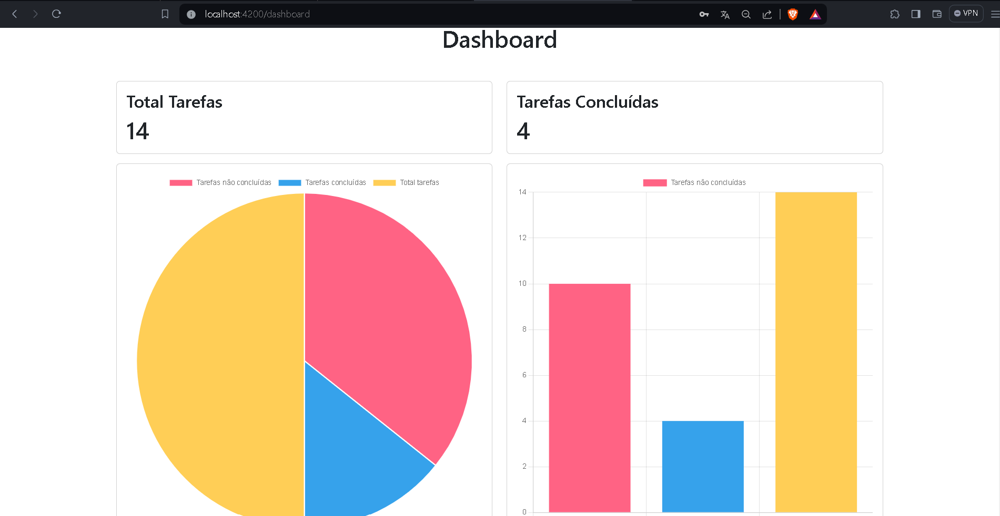

<h1 align="center">Visualizar Páginas</h1>

  <h3>Acompanhe a como estão as páginas </h2>

 

# Página de Login

 Página de login do sistema, onde o usuário pode fazer login. 

# Lista de Tarefas a Fazer

 Página onde o usuário pode visualizar todas as tarefas designadas a ela. 

# Lista Tarefas Feitas

 Página onde o usuário pode visualizar todas as tarefas feitas por ela. 

# Dashboard 

 Página onde o usuário com o título de Admin pode visualizar um resumo das tarefas cadastradas, não concluídas e concluídas. 

